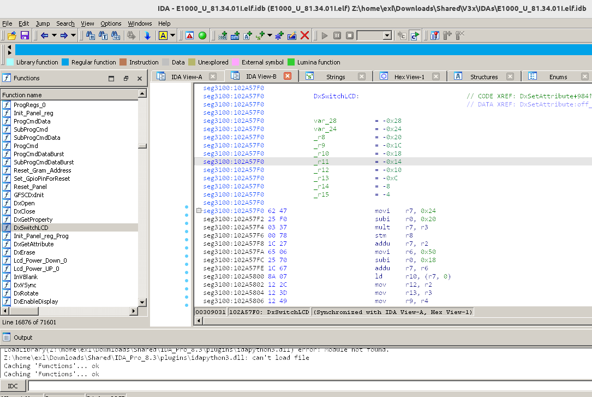

M·CORE support module for IDA Pro
=================================



IDA Pro processor module for M·CORE which is a low-power, RISC-based microcontroller architecture developed by Motorola intended for use in embedded systems.

Thanks to [@usernameak](https://github.com/usernameak) for porting it to IDA Pro 8.3, IDA Pro 9.0 and for improving/adding links to the symbols.

## Install

### IDA Pro 8.3

Copy [dll-8.3/mcore.dll](dll-8.3/mcore.dll) library to the `procs` IDA Pro directory.

### IDA Pro 9.0

Copy [dll-9.0/mcore_ida64.dll](dll-9.0/mcore_ida64.dll) library to the `procs` IDA Pro directory.

## Useful Tips

Activate the display of opcode bytes.

*Menu => Options => General... => Disassembly => Number of opcode bytes (non-graph) => "4" => OK*

An alternative and better way to change these values globaly is in the `cfg/ida.cfg` configuration file:

```
OPCODE_BYTES = 4
GRAPH_OPCODE_BYTES = 4
```

## Build Recipe

### IDA Pro 8.3

```
cmake -DIDA_EA64=OFF -DIDA_ROOT_DIR=D:\path\to\idasdk83
cmake --build .
```

### IDA Pro 9.0

```
cmake -DIDA_ROOT_DIR=D:\path\to\idasdk90
cmake --build .
```

## Additional Information

Please see original [ReadMe.txt](ReadMe.txt) document.

* [Motorola M-CORE CPU Module for IDA Pro](https://xtin.forum2x2.ru/t14-topic)
* [ELFs for M·CORE](https://forum.motofan.ru/index.php?showtopic=176195)
* [Rainbow POG PortKit & SDK](https://forum.motofan.ru/index.php?showtopic=149775)
* [V3x Research](https://forum.motofan.ru/index.php?showtopic=118082)
* [E770v Research](https://forum.motofan.ru/index.php?showtopic=117064)

## Authors & Thanks

* erithion
* yakk
* GanjaFuzz
* Chik_v
* theCore
* usernameak
* MotoFan.Ru developers
